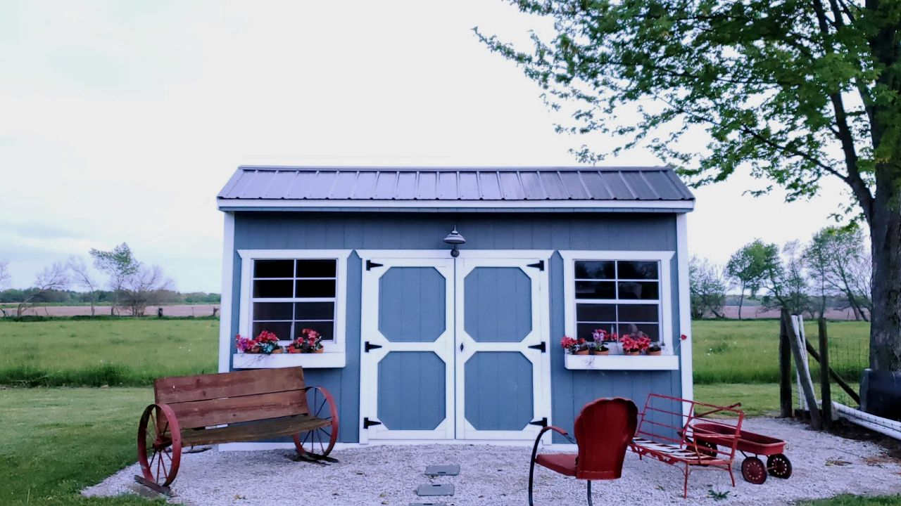
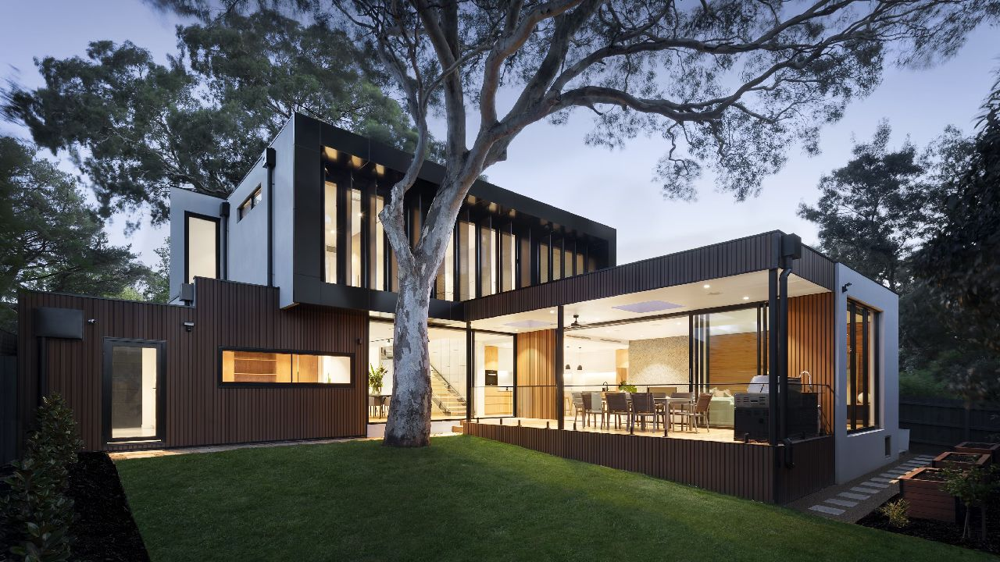

# Airbnb Clone Project 🏠

Next.js 14 / React, Tailwind, Django, Django Rest Framework

## Features
Fully responsive design built with Tailwind
Authentication using Django Allauth (Email log in)
How to use react-date-range and other packages
How to upload images using fetch
Live chat using web sockets

## Screenshots

## How to Run
npm run dev
# or
yarn dev
# or
pnpm dev
# or
bun dev
